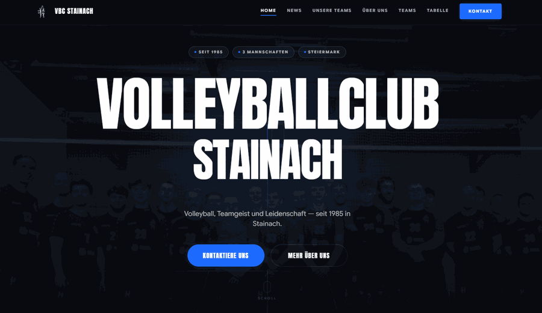

# VBC Stainach – Website & CMS

Offizielle Website des Volleyballvereins VBC Stainach, inklusive einem selbst entwickelten Admin-CMS-System zur Verwaltung aller Inhalte.



---

## Features

**Öffentliche Website**
- Startseite mit Vereinsstatistiken, Erfolgen, Galerie und Vereinsgeschichte (Zeitleiste)
- Teamseiten mit Spielerlisten
- Neuigkeiten / Newsbereich mit Artikeln und Tags
- Spielplan mit Heim- und Auswärtsspielen
- Sponsorenliste
- Vorstandsseite
- Rechtsseiten: Datenschutz, Impressum, Cookie-Richtlinie, Nutzungsbedingungen (`datenschutz.html`, `impressum.html`, `cookies.html`, `nutzungsbedingungen.html`)
- Kein Cookie-Banner: die Website setzt für Besucher keine Cookies (nur Admin-Session-Cookie), daher nach § 165 Abs. 3 TKG 2021 keine Einwilligung nötig
- Anmeldeformular mit erzwungener Datenschutz-Einwilligung (Client + Server), Einwilligungszeitpunkt wird gespeichert

**Admin-CMS**
- Selbst entwickeltes Content-Management-System unter `/admin`
- Sitzungsbasierter Login mit verschlüsselten Passwörtern (bcrypt)
- Vollständige CRUD-Verwaltung für alle Inhaltsbereiche:
  - Teams & Spieler
  - News (Entwurf / Veröffentlicht)
  - Spielplan
  - Vorstand
  - Galerie
  - Sponsoren
  - Vereinsgeschichte (Zeitleiste)
  - Erfolge & Statistiken
  - Seitentexte (editierbare Textabschnitte pro Seite)
- Medienbibliothek mit Bild-Upload (max. 10 MB, JPEG/PNG/GIF/WebP/SVG)
- Dashboard-Übersicht mit Live-Statistiken
- Passwort-Änderungsfunktion im Dashboard

---

## Technologie

| Bereich | Technologie |
|---|---|
| Backend | Node.js + Express |
| Datenbank | Supabase (PostgreSQL) |
| Authentifizierung | express-session + bcryptjs |
| Datei-Upload | multer |
| Frontend | Vanilla HTML, CSS, JavaScript |

---

## Voraussetzungen

- [Node.js](https://nodejs.org/) v18 oder neuer
- Ein kostenloses [Supabase](https://supabase.com/)-Konto

---

## Installation & Einrichtung

### 1. Repository klonen & Abhängigkeiten installieren

```bash
git clone https://github.com/KakknOGA/vbc_stainach-Website.git
cd vbc_stainach-Website
npm install
```

### 2. Supabase-Projekt erstellen

1. Gehe auf [supabase.com](https://supabase.com/) und erstelle ein neues Projekt.
2. Warte, bis das Projekt bereit ist (ca. 1–2 Minuten).

### 3. Datenbank-Schema einrichten

1. Öffne im Supabase-Dashboard: **SQL Editor**
2. Klicke auf **New query**
3. Kopiere den gesamten Inhalt der Datei `supabase-schema.sql` aus diesem Repository
4. Füge ihn ein und klicke auf **Run**

Alle Tabellen (Teams, Spieler, News, Galerie, etc.) werden automatisch angelegt.

> **Bestehende Datenbank (vor September 2026)?** Am Ende der Tabelle `registrations` in `supabase-schema.sql` stehen zwei `ALTER TABLE ... ADD COLUMN IF NOT EXISTS`-Zeilen (`consent_at`, `consent_version`). Diese einmalig im SQL-Editor ausführen – sonst schlägt das Anmeldeformular fehl, weil der Server den Zeitpunkt der Datenschutz-Einwilligung mitspeichert.

### 4. Umgebungsvariablen konfigurieren

Erstelle eine Datei `.env` im Hauptverzeichnis des Projekts (falls noch nicht vorhanden):

```
# Supabase-Verbindung
# URL ist fix (aus der Projekt-ID generiert)
SUPABASE_URL=https://DEINE-PROJEKT-ID.supabase.co

# Service-Role-Key: Supabase Dashboard → Project Settings → API → service_role (secret)
SUPABASE_SERVICE_KEY=dein-service-role-key-hier

# Session-Geheimnis (beliebige lange, zufällige Zeichenfolge)
SESSION_SECRET=ein-sicheres-geheimnis-hier-eintragen

# Port (optional, Standard: 3000)
PORT=3000
```

**Wo findest du die Supabase-Werte?**

- `SUPABASE_URL`: Supabase Dashboard → **Project Settings** → **Data API** → **Project URL**
- `SUPABASE_SERVICE_KEY`: Supabase Dashboard → **Project Settings** → **API** → **service_role** (geheim halten!)

> **Wichtig:** Die `.env`-Datei enthält sensible Zugangsdaten. Teile sie niemals öffentlich und checke sie nicht in Git ein.

### 5. Server starten

**Entwicklung** (mit automatischem Neustart bei Dateiänderungen):
```bash
npm run dev
```

**Produktion:**
```bash
npm start
```

### 6. Inhalts-Updates in eine bestehende Datenbank

`seed.js` befüllt beim Serverstart nur **leere** Collections und überschreibt nie
vorhandene Daten. Korrekturen an Timeline, Erfolgen, Statistik-Leiste, Ligen und
Seitentexten müssen daher separat nachgezogen werden:

```bash
node scripts/update-content-2026.js        # Trockenlauf: zeigt nur, was passieren würde
node scripts/update-content-2026.js --yes  # schreibt in die Datenbank
```

> **Achtung:** `timeline`, `achievements` und `stats` werden dabei vollständig
> ersetzt — im Admin-CMS ergänzte Einträge dieser drei Collections gehen verloren.
> Kader, News, Galerie und Sponsoren bleiben unberührt.

Der Server ist danach erreichbar unter:
- Website: [http://localhost:3000](http://localhost:3000)
- Admin-CMS: [http://localhost:3000/admin](http://localhost:3000/admin)

---

## Admin-Dashboard

Das Admin-Dashboard ist ein selbst entwickeltes CMS-System, das alle Vereinsinhalte über eine grafische Oberfläche verwaltbar macht – ohne direkten Datenbankzugriff.

### Erster Login

Es gibt kein Standardpasswort. Ist die Tabelle `users` leer, legt der Server den Benutzer `admin` nur an, wenn die Umgebungsvariable `ADMIN_INITIAL_PASSWORD` (mind. 12 Zeichen) gesetzt ist:

```env
ADMIN_INITIAL_PASSWORD=ein-langes-zufaelliges-passwort
```

**Nach dem ersten Start die Variable wieder entfernen.** Passwörter lassen sich im Dashboard unter "Passwort ändern" wechseln (12–72 Zeichen); das meldet alle anderen Geräte ab.

Der Login ist auf 10 Fehlversuche pro IP in 15 Minuten begrenzt. `SESSION_SECRET` ist in Produktion Pflicht, ohne startet der Server nicht.

### Verwaltbare Bereiche

| Bereich | Beschreibung |
|---|---|
| News | Artikel erstellen, bearbeiten, als Entwurf speichern oder veröffentlichen |
| Teams | Vereinsteams anlegen und bearbeiten |
| Spieler | Spieler einem Team zuordnen, Nummer und Position verwalten |
| Spiele | Eigene Termine (Trainingsmatch, Cup …) – werden zum Liga-Spielplan **dazugehängt**, nicht ersetzt |
| Vorstand | Vorstandsmitglieder mit Rolle und Foto |
| Galerie | Bilder hochladen und in der Galerie anzeigen |
| Sponsoren | Sponsoren mit Logo und Link verwalten |
| Zeitleiste | Vereinsgeschichte chronologisch darstellen |
| Erfolge | Auszeichnungen und Statistiken pflegen |
| Medienbibliothek | Bildverwaltung für alle hochgeladenen Dateien |
| Seitentexte | Editierbare Textabschnitte auf einzelnen Seiten |

---

## Projektstruktur

```
vbc_stainach-Website/
├── public/             # Alles, was der Server öffentlich ausliefert (Web-Root)
│   ├── index.html      # Startseite
│   ├── team.html       # Teamseite
│   ├── news.html       # Newsübersicht
│   ├── neuigkeiten.html # Newsartikel-Detailseite
│   ├── matches.html    # Spielplan
│   ├── anmelden.html   # Mitglieder-Anmeldeformular (Beitrittsanfrage)
│   ├── impressum.html, datenschutz.html, cookies.html, nutzungsbedingungen.html
│   ├── style.css       # Haupt-Stylesheet
│   ├── script.js       # Haupt-JavaScript
│   ├── cms.js          # Lädt die Inhalte aus der API in die Seiten
│   ├── WebsiteAssets/  # Bilder und Assets für die Website
│   ├── Spieler/        # Spielerfotos
│   ├── Icons/          # Icons
│   ├── Fonts/          # Schriftarten
│   └── uploads/        # Alte lokale Uploads (nicht in Git)
├── admin/              # Admin-Dashboard (HTML, CSS, JS) – nur über eigene Routen erreichbar
│   └── js/vendor/      # Lokal gehostetes Vue 3 (kein CDN-Request an unpkg)
├── lib/
│   ├── supabase.js     # Supabase-Client
│   ├── stvv-schedule.js # STVV-Spielplan abrufen (Server)
│   └── stvv-parse.js   # STVV-Parser (Server + Browser, als /lib/stvv-parse.js freigegeben)
├── server.js           # Express-Server & API
├── seed.js             # Datenbank-Seed-Logik (nur leere Collections)
├── scripts/
│   └── update-content-2026.js  # Einmaliges Inhalts-Update für eine bereits befüllte DB
├── supabase-schema.sql # Datenbankschema für Supabase
├── .env                # Umgebungsvariablen (nicht in Git)
└── package.json
```

---

## API-Endpunkte (Übersicht)

| Methode | Pfad | Beschreibung | Auth |
|---|---|---|---|
| GET | `/api/news` | Alle veröffentlichten News | Nein |
| GET | `/api/news/:id` | Einzelner Artikel | Nein |
| POST | `/api/news` | Artikel erstellen | Ja |
| PUT | `/api/news/:id` | Artikel bearbeiten | Ja |
| DELETE | `/api/news/:id` | Artikel löschen | Ja |
| GET | `/api/fixtures/upcoming` | Kommende Spiele (Liga + eigene Termine) | Nein |
| GET | `/api/collections/:name` | Collection-Daten lesen | Nein |
| POST | `/api/collections/:name` | Eintrag erstellen | Ja |
| PUT | `/api/collections/:name/:id` | Eintrag bearbeiten | Ja |
| DELETE | `/api/collections/:name/:id` | Eintrag löschen | Ja |
| POST | `/api/media` | Bild hochladen | Ja |
| DELETE | `/api/media/:id` | Bild löschen | Ja |
| POST | `/api/auth/login` | Einloggen | Nein |
| POST | `/api/auth/logout` | Ausloggen | Ja |

Verfügbare Collections: `teams`, `players`, `board`, `games`, `sponsors`, `gallery`, `timeline`, `achievements`, `stats`

### Nächste Spiele auf der Startseite

Der Abschnitt „Nächste Spiele“ zeigt den Ligaspielplan der **1. Mannschaft**
direkt vom Steirischen Volleyballverband (Volleystation) und mischt die im
Redaktionssystem erfassten Termine dazu. Sortiert wird nach Datum – das
zeitlich nächste Spiel steht immer oben und ist hervorgehoben.

* Eigene Einträge **ergänzen** den Ligaspielplan. Nur wenn Datum und Paarung
  exakt übereinstimmen, gewinnt der händische Eintrag – so lassen sich Zeit
  oder Ort eines Ligaspiels korrigieren.
* Quelle und Mannschaft sind über Umgebungsvariablen einstellbar:
  `STVV_SCHEDULE_URL`, `STVV_TEAM`, `STVV_LEAGUE`, `STVV_VENUE`.
* Cloudflare lässt den Abruf nur aus einem echten Browser durch. Der Server
  versucht es (Cache: 6 h); wird er geblockt, holt `cms.js` den Spielplan im
  Browser des Besuchers nach (Cache: 30 min in der Session). Schlägt beides
  fehl, bleiben die eigenen Termine sichtbar.
* **Einmalig nötig:** `scripts/migration-games-date.sql` im Supabase-SQL-Editor
  ausführen. Sie ergänzt die Spalte `games.date`. Fehlt sie, lässt der Server
  das Datumsfeld beim Speichern weg und die Startseite rechnet Tag/Monat auf
  das nächstgelegene Jahr hoch.
